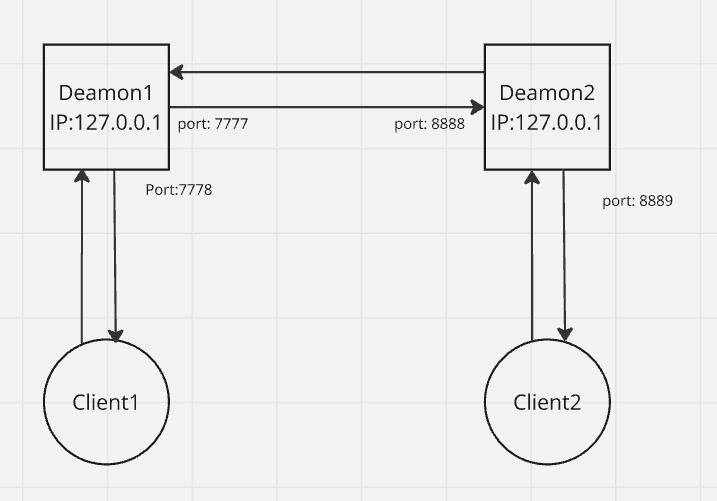

# SIMP: Lightweight UDP-Based Messaging Protocol
*by: Márió Palágyi (@MarioP03), Nevin Joseph @ IMC Krems*

**Overview of Contents**
- Introduction and Structure
- Libraries/Dependencies
- Execution Guide
- Description of Relevant Parts
- Interaction of Modules
- A guide on executing the project
- Takeaways
---

## 1. Introduction and Structure
This chapter introduces the SIMP Protocol, short for "Simple IMC Messaging Protocol", a simple chat messaging system that allows two users to communicate. The project’s goal was to create this protocol using UDP, which is chosen because it’s simpler and doesn’t require the connection setup that TCP does. While UDP is less secure, we ensured messages are not lost by implementing specific measures.

Graphical general representation of how, on what IP address and what number do the different entities communicate inside our project.

## 2. Libraries/Dependencies
Regarding external libraries, outside of Python's standard library system, we didn't use any, so there is nothing to explain in that regard. Each dependency that we used is contained in the standard Python library.
Although we haven't used any external libraries, we're still going to give a short review of the ones we used.
The libraries that we imported from the standard library system are:
**simp_daemon.py:**
- socket - for sending information from server to client and vice versa
- threading - for implementing the daemon logic
- json - for building messages
- sys - for controlling command line parameters
- time - for implementing the timeout logic for stop-and-wait

## 3. Execution Guide
Let's look at how to execute the project since this is one the most important parts:
1. Start 2 separate terminals.
2. Execute the command `python simp_daemon.py` (instead of "python" there might be some instances where "py" will also work) in two terminals.
3. On one terminal, when the program asks for port input, give 7777 for daemon-to-daemon and 7778 for client-to-daemon communication.
4. On the other terminal, when the program asks for port input, give 8888 for daemon-to-daemon and 8889 for client-to-daemon communication (the numbers 8888 and 8889 are not mandatory, they were not included in the assignment description; they are what we chose as standard during testing).
5. Then, open two other terminals (or with tools such as VSCode, we can create two and split them, for easier viewing) and run `python simp_client.py` (or "py" whichever works for you) in both.
6. When the client terminals ask to enter the client-daemon port, give the appropriate port numbers to them (for first client, it shall be 7778 and for the second one 8889).
7. Then for both clients you shall input a username of your choice.
8. After entering the username, a *"menu"* pops up, and you shall choose what action you want to follow. The meanings are self explanatory, so to work in order, for the first client, you choose option #1 and you shall give the *other daemon's* port number (which in our case is either 7777 or 8888).
9. For the second client, you shall choose option #2 and accept the incoming chat request if you want to chat.
10. After the connection is made, you can now send messages from one client to the other, BUT you always have to wait for an answer from the other client (as specified in the assignment). Whenever you want to quit, just type "q" in the chat and the program will exit you from the messaging.
### As for testing a third user
We follow the same steps for creating a daemon and a client
- Open two terminals, one for executing `simp_daemon.py` and the other for executing `simp_client.py`
- We used the port numbers 6666 for daemon-to-daemon and 6667 for daemon-to-client communication in this instance, but as said earlier, the numbers are free to decide
- After we chose a username on the client terminal, we try to connect to one of the daemons by choosing option #1 (input port 7777 or 8888).
- As we can see, the client gets kicked out instantly and the conversation of the 2 users remains undisturbed.

## 4. Description of Relevant Parts
This paragraph is informative of all the relevant modules, that we created in order to achieve the desired result of the program.
We did it in a way, specifying the IP address as `127.0.0.1` for both daemons, so the program is testable on one computer, simulating real-life user interaction.
**File - simp_daemon.py**
This file is the central component for managing communication for clients and other daemons. The most important part is the class *Daemon*. It contains an initialization function, with necessary variables for our daemon instances and also 4 important functions: 
- send_with_stop_and_wait
- handle_client_messages
- handle_daemon_messages
- run
How these functions work in detail is provided in the code itself.
Why this file is relevant is because:
- it manages sockets for the communication of daemons and clients
- performs the three-way handshake protocol which establishes chat sessions
- manages the turn-based messaging protocol
- ensures reliable messaging through the retransmission made possible by `send_with_stop_and_wait`
- contains the threading logic (in `run` function), that is crucial for simulating a daemon in chat messaging applications.
We also include the class "Datagram" from our file called "protocol.py" (we intentionally didn't name this "simp_protocol.py" so it doesn't look similar to other file names). The goal of this file will be more clear later, but the main focus is this module provides utilities for creating and parsing datagrams used in the communication. It contains the details of the payload creation, so the "simp_daemon.py" file doesn't get overcrowded, we could focus on creating functionality there.
**File - simp_client.py**
This file is another crucial element in the scope of this project as it simulates the client part of the messaging application, that probably stands the closest to the user, it's what they directly communicate with and also displays the incoming messages for them. This file accepts and "translates" the messages from the daemon, in order to create something that users can interact with and control the flow of the chat. 
Its key functions are:
- handle_messages
- show_menu
- connect
- chat
- run
So to summarize , this file is important because:
- it establishes a connection with the daemon entity
- sends and receives messages
- interacts with the user through a menu interface
- manages chat sessions, initiates, quits and flow

## 5. Interaction of Modules
This paragraph tells how the aforementioned modules work together on the larger scale.
**Between Client and Daemon**
Client relies on the daemon to initiate a connection, send messages and creating interactions with others, while the daemon is an intermediary that processes messages from clients and is the coordinator of communication between other daemons.
How it works:
- The Client sends a request for connection to the Daemon using the connect funtion. The Daemon acknowledges this connection and provides the client to the chat system.
- When a Client initiates a chat (with start_chat function), the Daemon sends a SYN datagram to the target daemon (handling the other client). The three-way handshake is managed by the Daemon.
- The Client relies on the Daemon to enforce turn-based messaging. If the client sends a message when it’s not their turn, the Daemon notifies them with error.
- When the Client quits the chat, the Daemon communicates this change to other involved daemons and the target client.

**Between Daemon and Datagram**
The daemon relies on the datagram for correct message parsing and creation during communication. The Datagram is responsible for encoding and decoding message components, headers and payload.
The Daemon uses the create_datagram method to build control and chat datagrams for chat.
Incoming datagrams received by the Daemon are parsed using the parse_datagram function. This allows the daemon to extract details like message type, sequence number, username, and payload for further processing.

**Between Client, Daemon and Datagram**
The Client communicates with the Daemon through JSON format messages. These are recognized by the Daemon as datagrams created using the Datagram module. Furthermore, the Datagram module ensures the Daemon can properly handle the communication with other daemons.
How they work together:
- A Client sends a JSON-formatted chat to the Daemon. The Daemon encapsulates this message in a datagram and sends it to another daemon, which then forwards it to the intended recipient client.
- The Daemon ensures that all clients adhere to the protocol by translating between JSON messages (used by clients) and datagrams (used between daemons).
- When a message is received by the daemon, it parses the datagram, validates the sequence number, and forwards the message payload to the target client.
Why need threading?
Firstly, both Client and Daemon use threads to manage simultaneous operations. Secondly, the Daemon runs threads for handling the client messages (handle_client_messages) and communication between (handle_daemon_messages). The Client runs threads for handling incoming messages and managing outgoing messages during active chats.

## 6. Takeaways
This project was a hands-on exploration of networking fundamentals, emphasizing the challenges and solutions in reliable UDP communication. Key learning points include:
- Practical implementation of a three-way handshake and stop-and-wait protocol
- Managing multithreaded socket programming
- Ensuring message reliability and handling potential data loss in UDP communication

